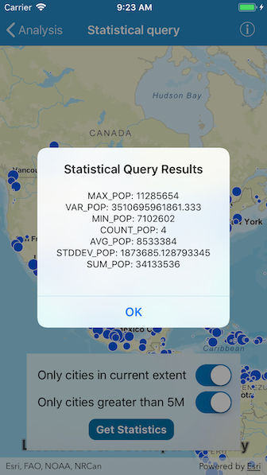

# Statistical query

Query a table to get aggregated statistics back for a specific field.

## Use case

For example, a county boundaries table with population information can be queried to return aggregated results for total, average, maximum, and minimum population, rather than downloading the values for every county and calculating statistics manually.

## How to use the sample

Pan and zoom to define the extent for the query. Use the "Cities in current extent" checkbox to control whether the query only includes features in the visible extent. Use the "Cities greater than 5M" checkbox to filter the results to only those cities with a population greater than 5 million people. Tap "Get statistics" to perform the query. The query will return population-based statistics from the combined results of all features matching the query criteria.

## How it works

1. Create an `AGSServiceFeatureTable` with a URL to the feature service.
2. Create `AGSStatisticsQueryParameters` using an array of `AGSStatisticDefinition` objects.
3. Pass in the parameters into `AGSFeatureTable.queryStatistics(with:completion:)`. Depending on the state of the two checkboxes, additional parameters are set.
4. Use `AGSStatisticsQueryResult.statisticRecordEnumerator()` on the first returned `AGSStatisticsQueryResult` to display each `AGSStatisticRecord`.

## Relevant API

* AGSServiceFeatureTable
* AGSStatisticDefinition
* AGSStatisticRecord
* AGSStatisticType
* AGSStatisticsQueryParameters
* AGSStatisticsQueryResult

## Tags

analysis, average, bounding geometry, filter, intersect, maximum, mean, minimum, query, spatial query, standard deviation, statistics, sum, variance
