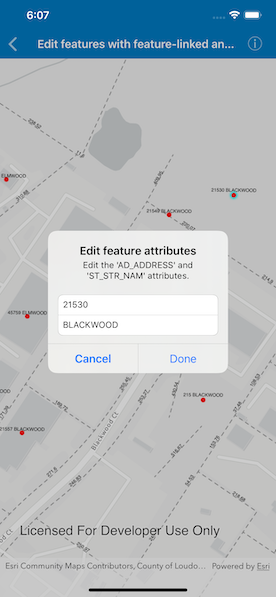

# Edit features with feature-linked annotation

Edit feature attributes which are linked to annotations through an expression.

## Use case

Annotations are useful for displaying text that you don't want to move or resize when the map is panned or zoomed (unlike labels which will move and resize). A Feature-linked annotation will update when a feature attribute referenced by the annotation expression is also updated. Additionally, the position of the annotation will transform to match any transformation to the linked feature's geometry.

## How to use the sample

Pan and zoom the map to see that the texts on the map are annotations, not labels. Tap one of the address points to update the house number (AD\_ADDRESS) and street name (ST\_STR\_NAM). Tap one of the dashed parcel polylines and tap another location to change its geometry. 

NOTE: Selection is only enabled for points and straight (single segment) polylines. The feature-linked annotation will update accordingly.

## How it works

1. Load the geodatabase using `AGSGeodatabase.load(completion:)`. 

    NOTE: Read/write geodatabases should normally come from an `AGSGeodatabaseSyncTask`, but this has been omitted here.
2. Create `AGSFeatureLayer`s from the geodatabase's array of feature tables.
3. Create `AGSAnnotationLayer`s from the feature tables.
4. Add the `AGSFeatureLayer`s and `AGSAnnotationLayer`s to the map's operational layers.
5. Assign an instance of a class that conforms to `AGSGeoViewTouchDelegate` to the map view's `touchDelegate` property.
6. Implement `geoView(_:didTapAtScreenPoint:mapPoint:)` to track taps on the map to either select address points or parcel polyline features. 

    NOTE: Selection is only enabled for points and straight (single segment) polylines.
    * For the address points, an alert is opened to allow editing of the address number (AD\_ADDRESS) and street name (ST\_STR\_NAM) attributes.
    * For the parcel lines, a second tap will change one of the polyline's vertices.

Both expressions were defined by the data author in ArcGIS Pro using [the Arcade expression language](https://developers.arcgis.com/arcade/).

## Relevant API

* AGSAnnotationLayer
* AGSFeature
* AGSFeatureLayer
* AGSGeodatabase

## Offline data

This sample uses data from [ArcGIS Online](https://arcgisruntime.maps.arcgis.com/home/item.html?id=74c0c9fa80f4498c9739cc42531e9948). It is downloaded automatically.

## About the data

This sample uses data derived from the [Loudoun GeoHub](https://geohub-loudoungis.opendata.arcgis.com/).

The annotations linked to the point data in this sample is defined by arcade expression `$feature.AD_ADDRESS + " " + $feature.ST_STR_NAM`. The annotations linked to the parcel polyline data is defined by `Round(Length(Geometry($feature), 'feet'), 2)`.

## Tags

annotation, attributes, feature-linked annotation, features, fields
