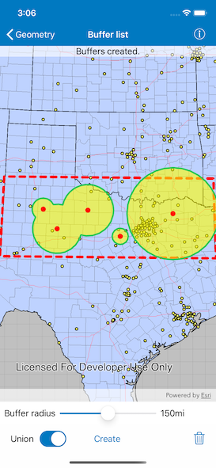

# Buffer list

Generate multiple individual buffers or a single unioned buffer around multiple points.

## Use case

Creating buffers is a core concept in GIS proximity analysis that allows you to visualize and locate geographic features contained within a set distance of a feature. For example, consider an area where wind turbines are proposed. It has been determined that each turbine should be located at least 2 km away from residential premises due to noise pollution regulations, and a proximity analysis is therefore required. The first step would be to generate 2 km buffer polygons around all proposed turbines. As the buffer polygons may overlap for each turbine, unioning the result would produce a single graphic result with a neater visual output. If any premises are located within 2 km of a turbine, that turbine would be in breach of planning regulations. 

## How to use the sample

Tap on the map to add points. Tap the create button to draw buffer(s) around the points (the radius of the buffer is determined by the value of the slider). Toggle on union if you want the result to union (combine) the buffers. Tap the trash button to start over. The red dashed envelope shows the area where you can expect reasonable results for planar buffer operations with the North Central Texas State Plane spatial reference.

## How it works

1. Use `class AGSGeometryEngine.bufferGeometries(_:distances:unionResults:)` to create a list of `AGSGeometry`.
    * The parameter `points` are the points to buffer around, `distances` are the buffer radius distances for each point (in the unit of the geometry's spatial reference) and `unionResults` is a boolean for whether the results should be unioned.
2. Add the resulting polygons (if not unioned) or single polygon (if unioned) to the map's `AGSGraphicsOverlay` as an `AGSGraphic`.

## Relevant API

* AGSGeometry
* AGSSpatialReference
* class AGSGeometryEngine.bufferGeometries(_:distances:unionResults:)

## Additional information

The properties of the underlying projection determine the accuracy of buffer polygons in a given area. Planar buffers work well when analyzing distances around features that are concentrated in a relatively small area in a projected coordinate system. Inaccurate buffers could still be created by buffering points inside the spatial reference's envelope with distances that move it outside the envelope. On the other hand, geodesic buffers consider the curved shape of the Earth's surface and provide more accurate buffer offsets for features that are more dispersed (i.e., cover multiple UTM zones, large regions, or even the whole globe). See the "Buffer" sample for an example of a geodesic buffer.

For more information about using buffer analysis, see the topic [How Buffer (Analysis) works](https://pro.arcgis.com/en/pro-app/tool-reference/analysis/how-buffer-analysis-works.htm) in the *ArcGIS Pro* documentation.

## Tags

analysis, buffer, geometry, planar
