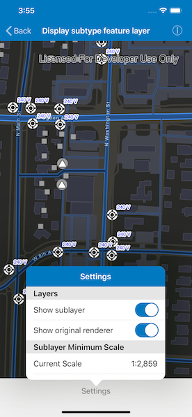

# Display subtype feature layer

Display a composite layer of all the subtype values in a feature class.

## Use case

This is useful for controlling labeling, visibility, and symbology of a given subtype as though they are distinct layers on the map.

## How to use the sample

The sample loads with the sublayer visible on the map. Toggle its visibility by tapping the first switch. Toggle between the sublayer's original renderer and an alternate renderer using the second switch. Tap the
 "Set Current to Minimum Scale" button to set the sublayer's minimum scale to the current map scale.

## How it works
1. Create an `AGSSubtypeFeatureLayer` from an `AGSServiceFeatureTable` that defines a subtype, and add it to the `AGSMap`.
2. Get an `AGSSubtypeSublayer` from the subtype feature layer using its name.
3. Enable the sublayer's labels and define them with `AGSLabelDefinition`.
4. Make a switch to toggle the sublayer's visibility.
5. Create an alternate renderer by making an `AGSSimpleRenderer`.
6. Get the current map scale and make it the minimum map scale.

## Relevant API

* AGSLabelDefinition
* AGSServiceFeatureTable
* AGSSubtypeFeatureLayer
* AGSSubtypeSublayer

## About the data

The [feature service layer](https://sampleserver7.arcgisonline.com/arcgis/rest/services/UtilityNetwork/NapervilleElectric/FeatureServer/100) in this sample represents an electric network in Naperville, Illinois, which contains a utility network with asset classification for different devices.

## Tags

asset group, feature layer, labeling, sublayer, subtype, symbology, utility network, visible scale range
