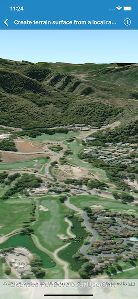

# Create terrain from a local raster

Set the terrain surface with elevation described by a raster file.

## Use case

The terrain surface is what the basemap, operational layers, and graphics are draped on. Supported raster formats include:

* ASRP/USRP
* CIB1, 5, 10
* DTED0, 1, 2
* GeoTIFF
* HFA
* HRE
* IMG
* JPEG
* JPEG 2000
* NITF
* PNG
* RPF
* SRTM1, 2

## How it works

1. Create an `ArcGISScene` and add it to a `SceneView`.
1. Create a `RasterElevationSource` with a list of raster file paths.
1. Add this source to the scene's base surface: `ArcGISScene.baseSurface.elevationSources.add(RasterElevationSource)`.

## Relevant API

* RasterElevationSource
* Surface

## About the data

This raster data comes from Monterey, California.

## Offline data

1. Download the data from [ArcGIS Online](https://arcgisruntime.maps.arcgis.com/home/item.html?id=98092369c4ae4d549bbbd45dba993ebc).
2. Extract the contents of the downloaded zip file to disk.
3. Add the contents into your Xcode project in argis-ios-sdk-samples/Shared resources/Rasters.
4. Select the imported files and create tags in under On Demand Resource Tags in the File Inspector.
5. Include the new tags in the array of Dependencies in ContentPList.plist.

<table>
<tr>
<th> Link </th>
<th>Local Location</th>
</tr>
<tr>
<td><a href="https://arcgisruntime.maps.arcgis.com/home/item.html?id=98092369c4ae4d549bbbd45dba993ebc">Monterey Elevation Raster</a></td>
<td><code><userhome>/ArcGIS/Raster/dt2/MontereyElevation.dt2 </code></td>
</tr>
</table>

## Tags

3D, raster, elevation, surface
