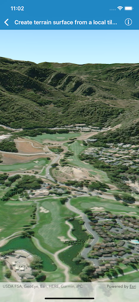

# Create terrain from a local tile package

Set the terrain surface with elevation described by a local tile package.

## Use Case

In a scene view, the terrain surface is what the basemap, operational layers, and graphics are draped onto. For example, when viewing a scene in a mountainous region, applying a terrain surface to the scene will help in recognizing the slopes, valleys, and elevated areas.

## How it works

1. Create an `AGScene` and add it to a `AGSSceneView`.
2. Create an `AGSArcGISTiledElevationSource` with the path to the local tile package.
3. Add this source to the scene's base surface.

## Relevant API

* AGSArcGISTiledElevationSource
* AGSSurface

## Offline data

This sample uses the [Monterey Elevation](https://arcgisruntime.maps.arcgis.com/home/item.html?id=cce37043eb0440c7a5c109cf8aad5500) tile package. It is downloaded from ArcGIS Online automatically.

## About the data

This terrain data comes from Monterey, California.

## Additional information

The tile package must be a LERC (limited error raster compression) encoded TPK. Details on can be found in the topic [Share a tile package](https://pro.arcgis.com/en/pro-app/help/sharing/overview/tile-package.htm) in the *ArcGIS Pro* documentation.

## Tags

3D, tile cache, elevation, surface
